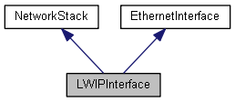

# Porting and testing

##New Device 
The NetworkSocketAPI is designed to make porting new devices as easy as possible and only requires a handful of methods for a minimal implementation.

<span class="images">

</span>

A new device must implement a [[https://developer.mbed.org/teams/NetworkSocketAPI/code/NetworkSocketAPI/docs/tip/classNetworkStack.html|##NetworkStack##]] with the naming convention of **DeviceInterface** where **Device** is a unique name that represents the device or network processor. The **DeviceInterface** should inherit one additional of the following unless it is an abstract device: The currently defined subclasses are:

* [EthernetInterface](https://docs.mbed.com/docs/testing-docs-features/en/latest/api/classEthernetInterface.html)
* [WiFiInterface](https://docs.mbed.com/docs/testing-docs-features/en/latest/api/classWiFiInterface.html)
* [CellularInterface](https://docs.mbed.com/docs/testing-docs-features/en/latest/api/classCellularInterface.html)
* [MeshInterface](https://docs.mbed.com/docs/testing-docs-features/en/latest/api/classMeshInterface.html)

The **DeviceStack** implementation provides the following methods:

```cpp
/** Get the local IP address
 *
 *  @return         Null-terminated representation of the local IP address
 *                  or null if not yet connected
 */
const char *get_ip_address();

/** Get the local MAC address
 *
 *  @return         Null-terminated representation of the local MAC address
 */
const char *get_mac_address();

/** Opens a socket
 *
 *  Creates a network socket and stores it in the specified handle.
 *  The handle must be passed to following calls on the socket.
 *
 *  A stack may have a finite number of sockets, in this case
 *  NSAPI_ERROR_NO_SOCKET is returned if no socket is available.
 *
 *  @param handle   Destination for the handle to a newly created socket
 *  @param proto    Protocol of socket to open, NSAPI_TCP or NSAPI_UDP
 *  @return         0 on success, negative error code on failure
 */
int socket_open(void **handle, nsapi_protocol_t proto);

/** Close the socket
 *
 *  Closes any open connection and deallocates any memory associated
 *  with the socket.
 *
 *  @param handle   Socket handle
 *  @return         0 on success, negative error code on failure
 */
int socket_close(void *handle);

/** Bind a specific address to a socket
 *
 *  Binding a socket specifies the address and port on which to receive
 *  data. If the IP address is zeroed, only the port is bound.
 *
 *  @param handle   Socket handle
 *  @param address  Local address to bind
 *  @return         0 on success, negative error code on failure.
 */
int socket_bind(void *handle, const SocketAddress &address);

/** Listen for connections on a TCP socket
 *
 *  Marks the socket as a passive socket that can be used to accept
 *  incoming connections.
 *
 *  @param handle   Socket handle
 *  @param backlog  Number of pending connections that can be queued
 *                  simultaneously
 *  @return         0 on success, negative error code on failure
 */
int socket_listen(void *handle, int backlog);

/** Connects TCP socket to a remote host
 *
 *  Initiates a connection to a remote server specified by the
 *  indicated address.
 *
 *  @param handle   Socket handle
 *  @param address  The SocketAddress of the remote host
 *  @return         0 on success, negative error code on failure
 */
int socket_connect(void *handle, const SocketAddress &address);

/** Accepts a connection on a TCP socket
 *
 *  The server socket must be bound and set to listen for connections.
 *  On a new connection, creates a network socket and stores it in the
 *  specified handle. The handle must be passed to following calls on
 *  the socket.
 *
 *  A stack may have a finite number of sockets, in this case
 *  NSAPI_ERROR_NO_SOCKET is returned if no socket is available.
 *
 *  This call is non-blocking. If accept would block,
 *  NSAPI_ERROR_WOULD_BLOCK is returned immediately.
 *
 *  @param handle   Destination for a handle to the newly created socket
 *  @param server   Socket handle to server to accept from
 *  @return         0 on success, negative error code on failure
 */
int socket_accept(void **handle, void *server);

/** Send data over a TCP socket
 *
 *  The socket must be connected to a remote host. Returns the number of
 *  bytes sent from the buffer.
 *
 *  This call is non-blocking. If send would block,
 *  NSAPI_ERROR_WOULD_BLOCK is returned immediately.
 *
 *  @param handle   Socket handle
 *  @param data     Buffer of data to send to the host
 *  @param size     Size of the buffer in bytes
 *  @return         Number of sent bytes on success, negative error
 *                  code on failure
 */
int socket_send(void *handle, const void *data, unsigned size);

/** Receive data over a TCP socket
 *
 *  The socket must be connected to a remote host. Returns the number of
 *  bytes received into the buffer.
 *
 *  This call is non-blocking. If recv would block,
 *  NSAPI_ERROR_WOULD_BLOCK is returned immediately.
 *
 *  @param handle   Socket handle
 *  @param data     Destination buffer for data received from the host
 *  @param size     Size of the buffer in bytes
 *  @return         Number of received bytes on success, negative error
 *                  code on failure
 */
int socket_recv(void *handle, void *data, unsigned size);

/** Send a packet over a UDP socket
 *
 *  Sends data to the specified address. Returns the number of bytes
 *  sent from the buffer.
 *
 *  This call is non-blocking. If sendto would block,
 *  NSAPI_ERROR_WOULD_BLOCK is returned immediately.
 *
 *  @param handle   Socket handle
 *  @param address  The SocketAddress of the remote host
 *  @param data     Buffer of data to send to the host
 *  @param size     Size of the buffer in bytes
 *  @return         Number of sent bytes on success, negative error
 *                  code on failure
 */
int socket_sendto(void *handle, const SocketAddress &address, const void *data, unsigned size);

/** Receive a packet over a UDP socket
 *
 *  Receives data and stores the source address in address if address
 *  is not NULL. Returns the number of bytes received into the buffer.
 *
 *  This call is non-blocking. If recvfrom would block,
 *  NSAPI_ERROR_WOULD_BLOCK is returned immediately.
 *
 *  @param handle   Socket handle
 *  @param address  Destination for the source address or NULL
 *  @param data     Destination buffer for data received from the host
 *  @param size     Size of the buffer in bytes
 *  @return         Number of received bytes on success, negative error
 *                  code on failure
 */
int socket_recvfrom(void *handle, SocketAddress *address, void *buffer, unsigned size);

/** Register a callback on state change of the socket
 *
 *  The specified callback will be called on state changes such as when
 *  the socket can recv/send/accept successfully and on when an error
 *  occurs. The callback may also be called spuriously without reason.
 *
 *  The callback may be called in an interrupt context and should not
 *  perform expensive operations such as recv/send calls.
 *
 *  @param handle   Socket handle
 *  @param callback Function to call on state change
 *  @param data     Argument to pass to callback
 */
void socket_attach(void *handle, void (*callback)(void *), void *data);

```

## Sockets

As a part of implementing the NetworkStack interface, a new device must implement a series of **socket_** functions. A **void** ***** is provided to pass socket-specific context between these functions. The socket functions are managed by the [[https://developer.mbed.org/teams/NetworkSocketAPI/code/NetworkSocketAPI/docs/tip/classSocket.html|##Socket##]] classes and implementation functions are hidden from the user.

## Errors

The convention for the NetworkSocketAPI is to have functions that may fail and return a signed integer. To indicate success, the function should return a **non-negative integer** which may also contain the size of a transaction. To indicate failure the function should return a negative integer which should be one of the following error codes from the **nsapi_error_t** enum:

```cpp
/** Enum of standardized error codes 
 *
 *  Valid error codes have negative values and may
 *  be returned by any network operation.
 *
 *  @enum nsapi_error_t
 */
enum nsapi_error_t {
    NSAPI_ERROR_WOULD_BLOCK   = -3001,     /*!< no data is not available but call is non-blocking */
    NSAPI_ERROR_UNSUPPORTED   = -3002,     /*!< unsupported configuration */
    NSAPI_ERROR_NO_CONNECTION = -3003,     /*!< not connected to a network */
    NSAPI_ERROR_NO_SOCKET     = -3004,     /*!< socket not available for use */
    NSAPI_ERROR_NO_ADDRESS    = -3005,     /*!< IP address is not known */
    NSAPI_ERROR_NO_MEMORY     = -3006,     /*!< memory resource not available */
    NSAPI_ERROR_DNS_FAILURE   = -3007,     /*!< DNS failed to complete successfully */
    NSAPI_ERROR_DHCP_FAILURE  = -3008,     /*!< DHCP failed to complete successfully */
    NSAPI_ERROR_AUTH_FAILURE  = -3009,     /*!< connection to access point failed */
    NSAPI_ERROR_DEVICE_ERROR  = -3010,     /*!< failure interfacing with the network processor */
};
```
## Testing

When adding new device support there is a test harness that can be used to verify implementations. The test program is very simple since it only needs to instantiate the new network interface and all further operations are performed against the managed classes.

[](https://github.com/iriark01/testing_docs_tools/blob/master/samples/ESP8266InterfaceTests/main.cpp)


```cpp
// replace 0.0.0.0 with the ip address of the host pc running the echo_server.py script
nsapi_tests("ESP8266Interface Tests", &iface, "0.0.0.0", 4000);
```

The test harness library is **NSAPITests.** It relies on a python echo server which is also part of that repo. Make sure to change the IP address in the interface test program to point at the computer that is running the script.
<<library /teams/NetworkSocketAPI/code/NSAPITests/>>

## References

<<library /teams/NetworkSocketAPI/code/ESP8266Interface/>>

[](https://docs.mbed.com/docs/testing-docs-features/en/latest/api/classLWIPInterface.html)
